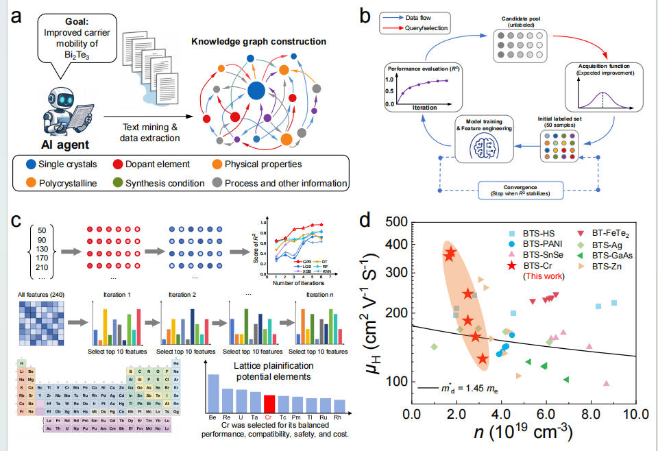

[English](README.md)

# 面向载流子迁移率的 AI 数据集构建与主动学习框架

本项目提供一套面向材料载流子迁移率研究的模块化工作流，覆盖 **数据集构建、特征工程、主动学习和候选材料筛选**。

这套方法的目标是能够 **扩展到不同材料体系**。当前仓库以 **Bi₂Te₃ 基热电材料作为案例（case study）** 展示完整流程，但项目本身并不限定于 Bi₂Te₃。

**数据集构建 → 特征工程 → 主动学习 → 候选材料筛选**

整个工作流由四个相互衔接的阶段组成。数据集构建既可以从已有结构化记录开始，也可以从用户指定文献开始；当使用文献输入时，Agent 会读取这些论文，识别样品级和实验条件级载流子迁移率数据，并转换为下游建模可以直接使用的结构化记录。随后由特征工程、模型迭代、采集函数和候选排序继续完成整个流程。

## 框架概览

| 模块 | 通用作用 | 本仓库中的 Bi₂Te₃ 案例 |
|---|---|---|
| **数据集构建** | 从已有结构化数据和用户指定文献构建载流子迁移率数据集 | 构建并扩展 Bi₂Te₃ 基材料载流子迁移率数据集 |
| **特征工程** | 将材料组成和实验条件转换为机器学习描述符 | 为 Bi₂Te₃ 基样品构建元素统计描述符 |
| **主动学习** | 迭代识别高信息量特征和高价值样本/候选 | 使用 LightGBM、GPR 与 Expected Improvement 学习 Bi₂Te₃ 数据 |
| **候选材料筛选** | 对未探索组成或材料改性方案进行预测和排序 | 对 Bi₂Te₃ 案例中的候选掺杂元素/组成进行优先级排序 |

## Bi₂Te₃ 案例

<p align="center">
  
</p>

上图展示的是本研究中对这套方法的具体应用：从文献和已有数据构建载流子迁移率数据集，生成材料与实验条件描述符，通过主动学习不断优化模型和候选空间，最终对 Bi₂Te₃ 基材料中的潜在掺杂方向进行评估。

项目刻意区分 **通用方法框架** 与 **材料体系特定配置**。如果应用到其他材料体系，可以替换输入数据/文献集合，并根据需要调整文献抽取 schema、host elements、材料描述符和候选空间，而无需重新实现整个主动学习流程。

## 工作流程

### 1. 数据集构建

结构化载流子迁移率数据集是文献/数据输入与下游机器学习之间的统一接口。在当前 Bi₂Te₃ 案例中，对应文件为 `data/Electricity_complete.csv`。

数据集构建模块支持两类来源：

- 已整理或已有的结构化实验数据；
- 从用户明确提供的科学文献中自动抽取的记录。

对于文献数据，Agent 可以接收本地 PDF/HTML、直接 URL、DOI，以及 JSON/CSV/TXT 文献清单。它读取正文和表格，识别载流子迁移率测量结果，提取样品级和实验条件级记录，映射到配置的数据 schema，并将 provenance 单独保存。

同一篇论文可以产生多条数据，例如不同材料组成、温度、载流子浓度、晶体形态或测量方向分别形成独立记录。文献发现不属于该模块：Agent 处理的是用户提供的文献集合。

### 2. 特征工程

材料组成和实验条件被转换为数值描述符。当前案例实现使用 30 类元素属性、4 种统计聚合方式以及对应的温度加权特征，共生成 240 个模型输入特征。

特征构建代码以材料组成为输入，并不依赖某一个固定化学式；当其他材料体系具有相应元素属性和输入字段时，可以复用同一套构建逻辑。

### 3. 迭代主动学习

每一轮主要包括：

1. 使用 LightGBM 计算特征重要性；
2. 去除强相关描述符；
3. 保留信息量最高的特征；
4. 使用 Matérn kernel 的 Gaussian Process Regression 建模；
5. 在固定测试集上评估模型性能；
6. 通过 Expected Improvement 选择下一批高价值样本。

这些建模步骤本身不依赖 Bi₂Te₃ 化学体系。材料特异性主要来自数据集、描述符、候选池，以及用于掺杂元素聚合的可配置 host-element 定义。

### 4. 候选材料筛选

模型迭代后，对候选样品进行预测和排序，为后续实验或计算验证提供优先级。在当前案例中，该模块用于比较与较高载流子迁移率相关的 Bi₂Te₃ 候选掺杂元素和组成。

应用到其他 host system 时，可以替换候选池并修改 `host_elements`，而不需要改变主动学习核心循环。

## 项目结构

```text
.
├── assets/
│   └── project_overview.png          # Bi2Te3 案例图
├── data/
│   ├── Electricity_complete.csv      # 案例载流子迁移率数据集
│   ├── FVectors_MMS.csv              # 案例预计算特征
│   ├── N_type_carrier.csv            # 目标值
│   ├── candidate.csv                  # 案例候选池
│   └── dataset_sources.csv
├── literature/
│   ├── AGENT_PIPELINE.md
│   ├── extraction_schema.json        # Bi2Te3 案例抽取配置
│   ├── extraction_schema.template.json
│   ├── agent_inputs.example.json
│   └── sources.csv
├── notebooks/
│   ├── 01_construct_features.ipynb
│   └── 02_active_learning_gpr.ipynb
├── src/
│   ├── features.py
│   ├── active_learning.py
│   └── literature_mining/
│       ├── agent.py
│       ├── pipeline.py
│       └── cli.py
├── tests/
├── literature_pipeline.py
├── requirements.txt
├── requirements-literature.txt
├── DATASET_SOURCES.md
├── references.bib
└── README.md
```

## 安装

运行完整项目：

```bash
python -m venv .venv
source .venv/bin/activate      # Windows: .venv\Scripts\activate
pip install -r requirements.txt
```

如果只运行文献到数据集的构建流程：

```bash
pip install -r requirements-literature.txt
```

## 快速开始：复现 Bi₂Te₃ 案例

### 构建材料特征

运行：

```text
notebooks/01_construct_features.ipynb
```

如果已经存在预计算的 `data/FVectors_MMS.csv` 和 `data/N_type_carrier.csv`，可以直接进入主动学习模块。

### 运行主动学习

运行：

```text
notebooks/02_active_learning_gpr.ipynb
```

默认案例配置包括：50 个初始训练样本、50 个固定测试样本、每轮选择 20 个高 Expected-Improvement 样本、保留 10 个特征、相关性阈值 0.95、`seed=2`，并使用 `host_elements=("Bi", "Te")` 对候选结果进行掺杂元素级聚合。

### 从指定文献扩展案例数据集

```bash
python literature_pipeline.py doctor
python literature_pipeline.py agent-run \
  --papers literature/agent_inputs.example.json \
  --schema literature/extraction_schema.json \
  --base data/Electricity_complete.csv \
  --output data/Electricity_complete.agent.csv \
  --provenance data/Electricity_complete.agent.provenance.jsonl \
  --report literature/agent_report.json
```

输出记录与 `data/Electricity_complete.csv` 使用相同 schema。DOI、页码/表格位置、原始证据、抽取方法和置信度等信息保存在独立 provenance 文件中，便于追踪每条数据的来源。

详细输入格式和扩展接口见 [`literature/AGENT_PIPELINE.md`](literature/AGENT_PIPELINE.md)。

## 迁移到其他材料体系

仓库中自带的数据和默认参数面向 Bi₂Te₃，是因为它是当前研究的 demonstration。迁移到其他材料体系时，主要修改的是输入和配置，而不是重写整个 pipeline：

1. 提供新的载流子迁移率数据集，或定义对应的数据字段映射；
2. 复制 `literature/extraction_schema.template.json`，为新材料体系设置元素过滤条件和字段别名；
3. 如果使用文献 Agent，提供该材料体系的目标文献；
4. 构建适合新体系的描述符和候选池；
5. 如需进行掺杂元素级统计，通过 `ActiveLearningConfig(host_elements=(...))` 指定 host elements。

例如：

```python
from src.active_learning import ActiveLearningConfig

config = ActiveLearningConfig(host_elements=("Sn", "Se"))
```

这样可以把 **可复用的方法框架** 与 **Bi₂Te₃ 案例的数据和科学假设** 清楚分开。

## 数据来源与 provenance

仓库中提供的数据集是 **Bi₂Te₃ 案例数据集**，来自 Bi₂Te₃ 基及相关热电材料的公开文献。其来源信息维护在：

- [`DATASET_SOURCES.md`](DATASET_SOURCES.md)：便于阅读的文献来源说明；
- [`references.bib`](references.bib)：BibTeX 文献库；
- [`data/dataset_sources.csv`](data/dataset_sources.csv)：机器可读的来源元数据。

这些文件描述的是当前 demonstration dataset，并不限定整个框架只能用于 Bi₂Te₃。

## 可复现性与科学定义

当前代码重构保留了原 Bi₂Te₃ 研究流程中的部分公式和定义，以维持已有模型输入和结果的可复现性。需要进一步科学确认的内容集中记录在 [`VALIDATION_NOTES.md`](VALIDATION_NOTES.md)，而不是在重构过程中静默修改。

## 测试

```bash
python -m unittest discover -s tests -v
```

## 贡献者

**Shulin Bai** — 北京航空航天大学  
**Pengfei Zhang** — 北京航空航天大学

更多信息见 [`CONTRIBUTORS.md`](CONTRIBUTORS.md)。

## 引用

如果你使用了本项目代码或仓库中提供的数据集，请引用对应研究工作。(论文还未发表，敬请期待)

## License

见 [`LICENSE`](LICENSE)。
